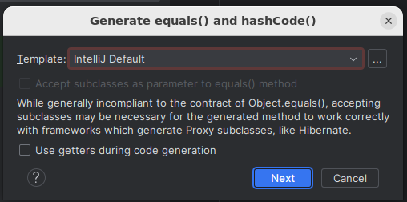

## Introduction
In a [previous article](../case_insensitive_string_hashmap), I discussed how to efficiently store strings in a hash map and search for them without worrying about case sensitivity. I explained how creating a custom wrapper class for `String` and overriding its `hashCode` and `equals` methods can achieve this goal, while ensuring good performance by minimizing the creation of additional strings.

However, this approach may not be ideal if you need to store objects that contain multiple strings. While you could still use the same wrapper class, there are at least two potential downsides to this approach. Firstly, it would result in increased memory usage due to the creation of additional objects. Secondly, there may be situations where you are unable or unwilling to modify the String type in carrier classes.

In this article, I will explore alternative solutions to this problem that can improve memory usage and avoid the need to modify existing classes.

## Example
Suppose we have a `Person` class with `firstName` and `lastName` fields. In order to ignore casing when comparing instances of this class, we can override the `equals` and `hashCode` methods.

The easiest way to implement these methods is to use an IDE, such as IntelliJ, which can automatically generate the code for you in a generic way. The code generator can be accessed through the IDE's interface, as shown below:

 

By default, the IDE will generate code using the `Objects.equals` method, which performs a case-sensitive comparison. The generated code with default methods can be seen below:

```java
public record Person (String firstName, String lastName) {
    @Override
    public boolean equals(Object o) {
        if (this == o) return true;
        if (o == null || getClass() != o.getClass()) return false;

        Person person = (Person) o;

        if (!Objects.equals(firstName, person.firstName)) return false;
        return Objects.equals(lastName, person.lastName);
    }

    @Override
    public int hashCode() {
        int result = firstName != null ? firstName.hashCode() : 0;
        result = 31 * result + (lastName != null ? lastName.hashCode() : 0);
        return result;
    }
}
```
We can modify the `equals` and `hashCode` methods to use our custom comparison method instead, as shown in the code below:

```java
public record Person (String firstName, String lastName) {

    @Override
    public boolean equals(Object o) {
        if (this == o) return true;
        if (o == null || getClass() != o.getClass()) return false;

        Person person = (Person) o;

        if (!StringUtils.ciEquals(firstName, person.firstName)) return false;
        return StringUtils.ciEquals(lastName, person.lastName);
    }

    @Override
    public int hashCode() {
        int result = StringUtils.ciHashCode(firstName);
        result = 31 * result + StringUtils.ciHashCode(lastName);
        return result;
    }
}
```
> Note: In the examples, records are used instead of classes. Records are essentially the same as classes, but they require less boilerplate code to create. This makes them ideal for demonstrating examples and reducing clutter in the code.
 
Rather than implementing a custom comparison method directly in a class, it is generally considered a better practice to place it in a utility class, such as `StringUtils`. This allows the method to be used across multiple classes and methods, and it also helps to keep the code modular and reusable. By implementing the custom comparison method in a utility class, we can easily ignore case sensitivity when comparing strings without having to create big changes.

Let's check how `StringUtils` class is implemented:

```java
public class StringUtils {
    private StringUtils() {}

    public static int ciHashCode(String stringVal) {
        if (stringVal == null) {
            return 0;
        }
        int h = 0;
        if (stringVal.length() > 0) {
            for (int i = 0; i < stringVal.length(); i++) {
                h = 31 * h + Character.toLowerCase(stringVal.charAt(i));
            }
        }
        return h;
    }

    public static boolean ciEquals(String a, String b) {
        return a == b || a != null && a.equalsIgnoreCase(b);
    }
}
```
> It's worth noting that if you are using the Apache Commons library in your project, you don't need to create a custom method for comparing strings, as the library already provides a method `equalsIgnoreCase` which does the same thing and it is located in the class with the same name.

The `hashCode` function is implemented similarly to the `hashCode` function in the `String` class. There are two differences. First, the value of the hash code is not stored in a variable for caching. Second, it converts every character to lowercase before using it for calculation. This allows us to efficiently store objects in a hash map without considering case sensitivity and by preserving original casing. By using these simple functions and an IDE code generator, we can create a class that is efficient for searching by keys.

## Conclusion
Using these simple functions and an IDE code generator, you can create case-insensitive classes that can be efficiently stored in a HashMap or other collections. This is particularly useful for storing objects as keys, as HashMaps provide fast key-based searches.

If you liked the content, you can find me on Twitter at [@mare_milenkovic](https://twitter.com/mare_milenkovic) and on LinkedIn at [mare-milenkovic](https://www.linkedin.com/in/mare-milenkovic/).